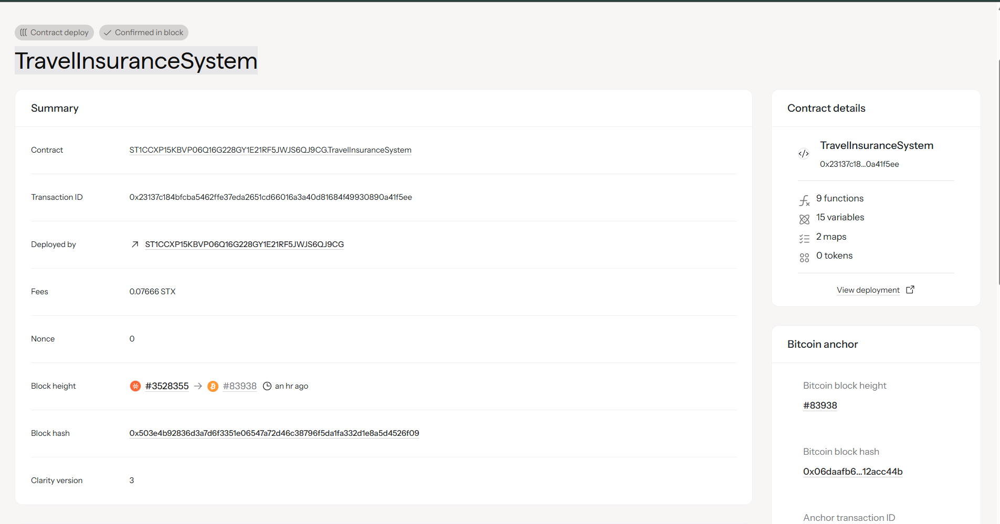

# Travel Insurance System

## Project Description

The Travel Insurance System is a comprehensive blockchain-based smart contract built on the Stacks network using Clarity language. This decentralized insurance platform provides travelers with transparent, automated, and secure insurance coverage for three critical areas: trip cancellations, medical emergencies, and lost luggage.

The system eliminates traditional insurance intermediaries by implementing smart contract logic that automatically handles policy purchases, premium calculations, and claim processing. Users can customize their coverage based on their specific travel needs and duration, while the blockchain ensures transparency and immutability of all insurance transactions.

## Project Vision

Our vision is to revolutionize the travel insurance industry by creating a decentralized, transparent, and user-centric insurance ecosystem. We aim to:

- **Democratize Access**: Make travel insurance accessible to everyone regardless of geographical location or traditional banking relationships
- **Eliminate Friction**: Remove bureaucratic delays and paperwork through automated smart contract execution
- **Ensure Transparency**: Provide complete visibility into policy terms, claim processing, and fund management through blockchain technology
- **Build Trust**: Create an immutable record of all insurance activities, ensuring fairness for both policyholders and the insurance pool
- **Enable Innovation**: Establish a foundation for community-driven insurance products and parametric insurance solutions

## Future Scope

The Travel Insurance System is designed with extensibility in mind. Future enhancements will include:

### Phase 2 - Enhanced Coverage
- **Weather-based Parametric Insurance**: Automatic payouts for flight delays due to severe weather conditions
- **Real-time Risk Assessment**: Integration with travel advisory APIs for dynamic premium pricing
- **Multi-destination Coverage**: Support for complex itineraries with multiple destinations and varying risk levels

### Phase 3 - Advanced Features  
- **Decentralized Autonomous Organization (DAO)**: Community governance for policy terms and claim dispute resolution
- **Oracle Integration**: Real-time data feeds for automatic claim validation (flight cancellations, weather events)
- **Cross-chain Compatibility**: Expansion to multiple blockchain networks for broader accessibility
- **Mobile Application**: Native mobile app with seamless policy management and instant claim submission

### Phase 4 - Ecosystem Expansion
- **Travel Partner Integration**: Direct integration with airlines, hotels, and booking platforms
- **Loyalty Token System**: Reward system for long-term users and claim-free travelers  
- **Group Policy Management**: Corporate and family group insurance plans
- **Reinsurance Layer**: Risk distribution through decentralized reinsurance pools

### Phase 5 - AI and Machine Learning
- **Predictive Analytics**: AI-driven risk assessment and personalized premium calculation
- **Fraud Detection**: Machine learning algorithms to identify and prevent fraudulent claims
- **Smart Recommendations**: Personalized coverage suggestions based on travel patterns and risk profiles

## Core Functions

### 1. Purchase Policy Function
- **Customizable Coverage**: Choose from cancellation, medical, and luggage protection
- **Dynamic Pricing**: Premium calculation based on coverage types and trip duration  
- **Flexible Duration**: Support for short trips to extended travel periods
- **Instant Activation**: Immediate policy activation upon premium payment

### 2. Submit Claim Function
- **Multi-type Claims**: Support for cancellation, medical, and luggage claims
- **Coverage Validation**: Automatic verification of claim eligibility against policy terms
- **Amount Verification**: Ensures claim amounts don't exceed coverage limits
- **Transparent Processing**: Immutable record of all claim submissions and outcomes

## Technical Features

- **Premium Pool Management**: Secure handling of premium payments and claim payouts
- **Policy Lifecycle Management**: Complete tracking from purchase to expiration
- **Owner Controls**: Administrative functions for claim processing and system management
- **Event Logging**: Comprehensive event emission for external system integration
- **Security Measures**: Multiple validation layers to prevent unauthorized access and fraudulent activities

## Contract Address Details
Contract ID : ST1CCXP15KBVP06Q16G228GY1E21RF5JWJS6QJ9CG.
TravelInsuranceSystem

- **Network**: Stacks Testnet
- **Contract Address**: ST1CCXP15KBVP06Q16G228GY1E21RF5JWJS6QJ9CG.
- TravelInsuranceSystem
- **Transaction ID**:         0x23137cf84bfcba5462ffe37eda2651cd660162a4041816824f49930890a41f5ee  
- **Block Height**: #3528355
- **Deployment Date**: 8/26/2025

---

*This project is part of the decentralized insurance ecosystem built on Stacks blockchain, leveraging Bitcoin's security for transparent and trustless travel insurance solutions.*
